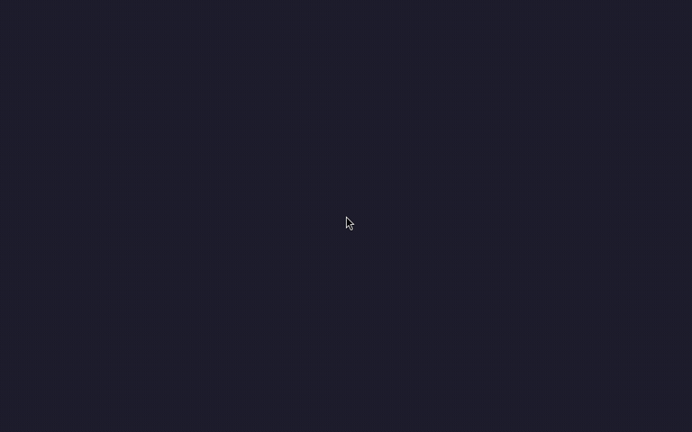

# wmsama

> A modern, elegant X11 reparenting compositing window manager written in Free Pascal for the **Samarinda Desktop Environment**, powered by **florialib**, **AggPas**, and **floria-toolkit**.

[](https://opensource.org/licenses/MPL-2.0)
[](https://www.freepascal.org/)
[](https://github.com/graemeg/pasbuild)

---

## Showcase



*Demonstrating vector window decorations, dynamic directional cursor feedback, outer perimeter resize protection with zero client text selection interference, edge snap tiling, divider resizing, and automatic cursor-centered titlebar un-tiling.*

---

## Highlights & Features

### 🎨 High-Fidelity Vector Decorations & Compositing
- **Sub-pixel Anti-Aliased Corners**: Rounded window borders with customizable top and bottom corner radii (default: 12px) rendered via AggPas 2D vector graphics engine.
- **Built-in Software Compositor**: Real-time soft drop shadows with configurable blur radius and opacity, client damage tracking, and optional frosted glass backdrop blur.
- **Override-Redirect Compositing**: Seamlessly composites menus, popups, dropdowns, and tooltips alongside managed windows.
- **Vector Titlebar Controls**: Close, Maximize/Restore, Minimize, Shade (rollup), Pin (sticky), and Window Menu buttons rendered dynamically with hover halo glows and vector icon glyphs via `floria-toolkit`.

### 🎯 8-Directional Perimeter Resizing (Zero Client Interference)
- **Outer Margin Hit Testing**: Resize triggers are situated exclusively in the outer frame margin padding (Top, Bottom, Left, Right, and 4 Corners).
- **Uninterrupted Client Selection**: 100% of the client window area is preserved for the application. Terminal users can drag-select text from column 0 or interact with native application scrollbars without triggering accidental window resizing.
- **Context-Sensitive Resize Feedback**: Automatically updates system cursors to matching directional shapes (`top_side`, `bottom_left_corner`, etc.) when hovering over outer resize margins and during active drag operations.

### 🪟 Interactive Edge Snapping & Smart Tiling
- **Screen Edge Snapping**: Drag windows to the left or right screen boundary to snap into a clean 50% split tile.
- **Divider Resizing**: Tiled windows constrain resizing to the dividing edge (e.g., right-tiled windows only allow width adjustments on their left divider border).
- **Cursor-Centered Un-Tiling & Un-Maximizing**: Dragging the titlebar of a tiled or maximized window instantly restores its floating dimensions while smoothly centering the titlebar under the pointer.

### 🖱️ Dynamic Cursor State Engine
- **Desktop & Titlebar**: Normal pointer cursor (`left_ptr`).
- **Interactive Margins**: Directional hover and active resize cursors (`top_side`, `bottom_side`, `left_side`, `right_side`, `top_left_corner`, `top_right_corner`, `bottom_left_corner`, `bottom_right_corner`).
- **Window Movement**: Omnidirectional move cursor (`fleur`) during drag-move actions.

### 🎛️ Configurable Controls & Theming
- **Button Styles**: Circle (macOS style), Squircle, or Square.
- **Button Alignment**: Left (macOS style) or Right (Windows / GNOME / KDE style).
- **Custom Button Layouts**: Syntax like `menu:shade,pin,minimize,maximize,close`.
- **Themes**: Built-in Dark and Light color schemes.
- **Alt+Tab Switcher HUD**: Built-in visual window switcher HUD.

---

## Project Architecture

```
wmsama/
├── project.xml                # PasBuild project descriptor
├── assets/
│   └── showcase.gif           # Live feature recording
├── src/
│   ├── main/pascal/
│   │   ├── wmsama.pas         # CLI entry point, signal handlers, and config parser
│   │   ├── wmsama.core.pas    # Window manager engine, input routing, tiling, resizing & compositor
│   │   └── wmsama.ft.pas      # Floria Toolkit vector button integration & styling
│   └── test/pascal/
│       ├── TestRunner.pas     # FPCUnit automated test harness
│       └── TWMSamaTest.pas    # Unit & integration test cases
```

---

## Dependencies & Requirements

- **Free Pascal Compiler (`fpc`)**: Version 3.2.2 or later
- **PasBuild**: Pascal project build tool
- **florialib**: Core library (`Floria.XCB`, `Floria.XCB.WM`, `Floria.XCB.WM.Compositor`, `AggPas`)
- **floria-toolkit (`libft.so`)**: Vector widget and window button rendering
- **X11 / XCB Development Libraries**:
  - `libxcb`, `libxcb-render`, `libxcb-shape`, `libxcb-composite`
  - `libxcb-damage`, `libxcb-cursor`, `libxcb-keysyms`, `libxcb-icccm`, `libxcb-ewmh`

---

## Building & Testing

### 1. Compile `wmsama`
```bash
pasbuild compile
```
The compiled executable will be placed in `target/wmsama`.

### 2. Run Automated Test Suite
```bash
pasbuild test
```
Executes all unit tests in `src/test/pascal/TWMSamaTest.pas` covering window creation, frame metrics, snapping, resizing, button placement, override-redirect compositing, and cursor states.

---

## Usage & Command-Line Options

```bash
./target/wmsama [options]
```

| Option | Description | Default |
|---|---|---|
| `--display <name>` | Target X11 display (e.g. `:2`) | `$DISPLAY` |
| `--no-compositor` | Run as pure reparenting WM without compositing | `false` |
| `--blur` | Enable real-time frosted glass backdrop blur | `false` |
| `--blur-radius <int>` | Backdrop blur radius | `15` |
| `--shadow-radius <int>` | Drop shadow radius in pixels | `14` |
| `--shadow-opacity <flt>` | Drop shadow opacity (0.0 – 1.0) | `0.35` |
| `--corner-radius <int>` | Top corner radius in pixels | `12` |
| `--bottom-radius <int>` | Bottom corner radius in pixels | `12` |
| `--button-style <style>` | Window button shape: `circle`, `squircle`, `square` | `circle` |
| `--buttons-left` | Align buttons to the left (macOS style) | (Default) |
| `--buttons-right` | Align buttons to the right (Windows/KDE style) | `false` |
| `--button-layout <lay>` | Custom button order (e.g. `menu:shade,pin,minimize,maximize,close`) | Auto |
| `--theme <theme>` | Color theme: `dark`, `light` | `dark` |
| `--libft <path>` | Custom path to `libft.so` | Auto |
| `--help`, `-h` | Display usage instructions | — |
| `--version`, `-v` | Show version information | — |

---

## Running in a Nested X Server (Xephyr)

To test or develop `wmsama` without disrupting your primary desktop session, run it inside a nested Xephyr server:

```bash
# 1. Launch Xephyr on display :2
Xephyr :2 -screen 1024x768 -ac &

# 2. Launch wmsama on display :2
./target/wmsama --display :2 &

# 3. Launch client applications inside the nested session
DISPLAY=:2 xterm &
DISPLAY=:2 xcalc &
```

---

## License

This project is licensed under the **Mozilla Public License 2.0 (MPL-2.0)**. See the project descriptor in [project.xml](project.xml) for licensing details.

---

## Author

**Dio Affriza** — *Samarinda Desktop Environment Project*
